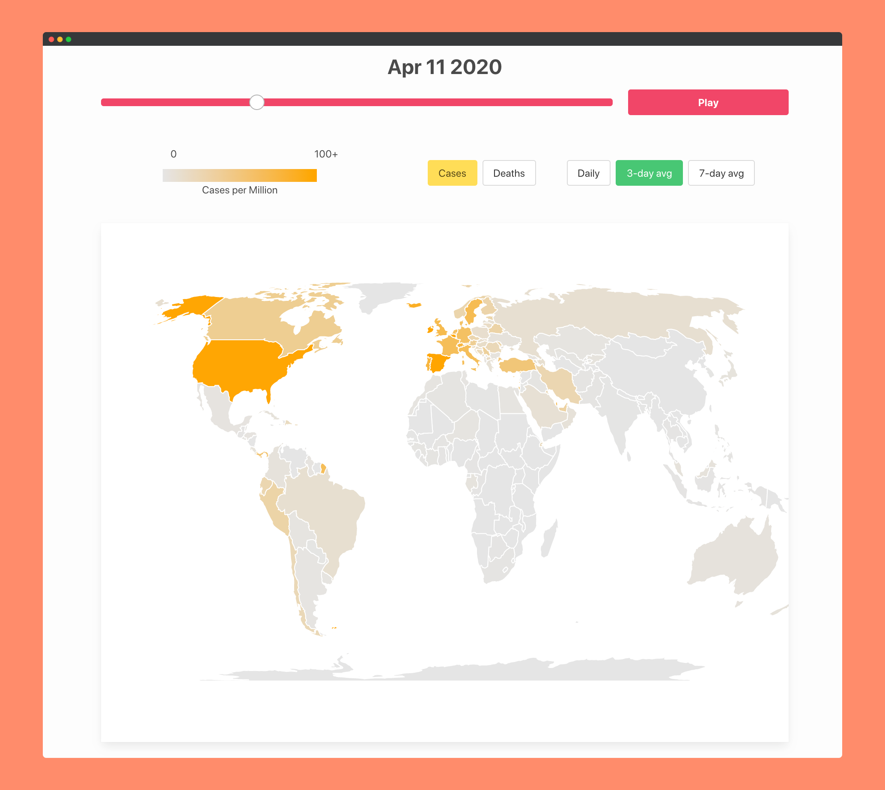

# Contagion Tracker

Visualizing the spread of all types of infections.

A MongoDB Hackathon project by Warren James, Nalin Ranjan, and Gabriel Buchdahl.

## To run application:

`source venv/bin/activate`

`npm start`

`npm run start-api`

Starts the flask backend on localhost:5000, React frontend on localhost:3000.

To do so, your python virtual environment should already have all dependencies installed and the config file should already have been created.

<!-- This should be done after `npm start` has been run to test the application with both the frontend and backend -->

## To set up virtual environment:

`python3 -m venv venv`

`source venv/bin/activate`

`pip install -r requirements.txt`

### Adding a python dependency:

While in your virtual environment, run the following:

`pip freeze > requirements.txt`

## To create config

`cd api`

`echo "MONGO_URI = '<connection_string>'" > config.py`

where `<connection_string>` is the connection string associated with our database.

Be sure to **never** commit this file to the repository.

## To build/compile CSS

`npm run css-build` or `npm run css-watch`

## To format:

`npm run format`
